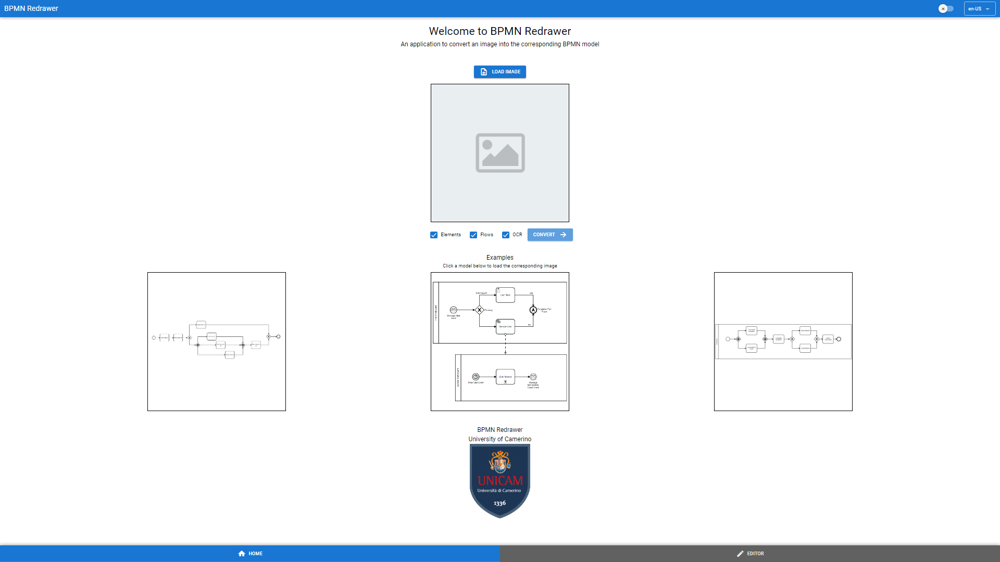
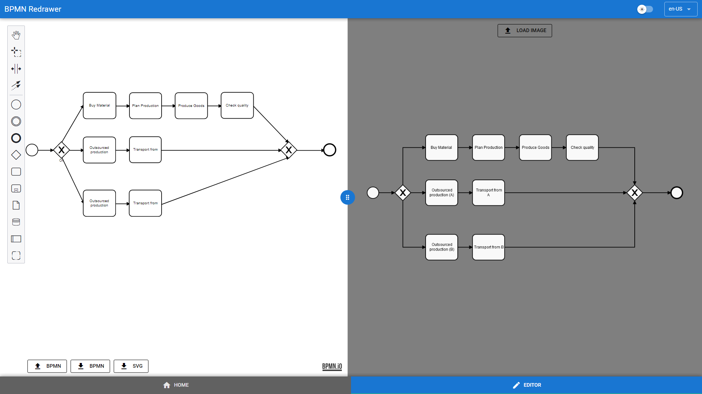
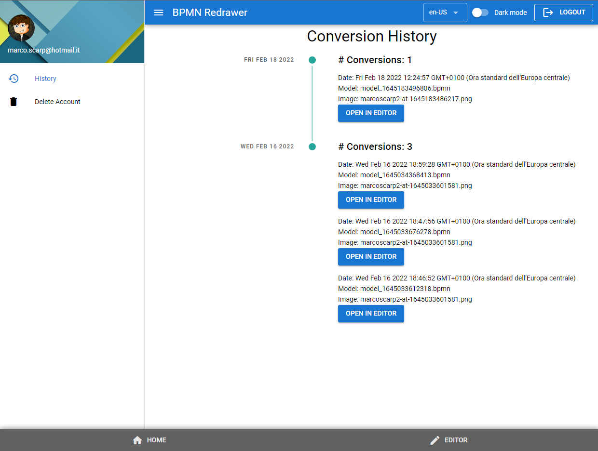

# BPMN Redrawer

Project developed using Scrum Methodology for the lab part of Software Project Management course, held by Prof. Fabrizio Fornari at the University of Camerino.

**The full documentation of the project is availble in the [GitHub Wiki](../../wiki)**

## Project Goal

The goal of the project consists of implementing a web application that allows to upload images (*.png*) of BPMN models and turns those images in actual BPMN models stored in *.bpmn* format.

## Functionalities

The user, through the simple and intuitive GUI, can load an image from the local storage in different formats (PNG, JPEG, BMP). The image is then displayed and is ready to be converted. After that, the backend receives the loaded image, extracts the elements and link them togheter in order to obtain the final *.bpmn* file. At this pont the result comes back to the frontend and, using the GUI, can be downloaded or can be shown and edited thanks to the integration of [*bpmn-js*](https://bpmn.io/toolkit/bpmn-js/) library.

Overall, the application is able to provide the following functionalities:
- Convert an image into the corresponding *.bpmn* model;
- Download the converted model;
- Visualize the converted model and, next to it, the starting image;
- Edit the converted model;
- Open, edit and download an existing *.bpmn* model;
- Create a BPMN model from scratch and download it as *.bpmn* file or *.svg* image;
- Register and login to leverage further features:
    - Visualize the conversion history;
    - Open, edit, save and download a previously converted model.

At present the application is able to detect the following BPMN elements with a fair average precision:

<table>
<tr><td>

|Element                          | AP
|---------------------------------|-----
| MessageEndEvent                 | 95.9
| InclusiveGateway                | 93.4
| SubProcess                      | 60.0
| MessageIntermediateThrowEvent   | 100.0
| ParallelGateway                 | 99.0
| EventBasedGateway               | 100.0
| SignalStartEvent                | 100.0
| TerminateEndEvent               | 100.0
| EscalationIntermediateThrowEvent| 100.0
| Task                            | 91.0
| ErrorEndEvent                   | 100.0
| SendTask                        | 99.3
| EndEvent                        | 97.7

</td><td>

|Element                         | AP
|--------------------------------|-----
| TimerIntermediateCatchEvent    | 97.9
| DataObjectReference            | 86.1
| StartEvent                     | 97.5
| ComplexGateway                 | 100.0
| UserTask                       | 87.4
| MessageIntermediateCatchEvent  | 95.5
| ServiceTask                    | 87.8
| Participant                    | 88.2
| MessageStartEvent              | 99.6
| ExclusiveGateway               | 96.3
| EscalationEndEvent             | 96.9
| TimerStartEvent                | 95.2
| IntermediateThrowEvent         | 98.0
</td></tr> </table>

Moreover it is able to detect and render *Sequence Flow* and *Message Flow*.

## Quickstart

Our web application is available and ready to use at the following link:
**[BPMN Redrawer](https://bpmn-redrawer.me/)**

The user can perform very simple steps to obtain a *.bpmn* file starting from an image:
- In the *HOME* window, you can load an image from local storage with the corresponding button;

- If correctly loaded, the image will be displayed;
- Then the *CONVERT* button can be used to start the conversion (it takes a few seconds to complete the process);
- Once the conversion is done, the user can either download or view and edit the resulting model;
- By selecting the *VIEW IN EDITOR* button, the *EDITOR* window will allow you to see the converted model and, if needed, to edit and correct it. The starting image is displayed next to the model and simplifies the revising process (the image can be hidden with the correspondig button);

- If you are happy with the result you can download the final model either as *.bpmn* file or as *.svg* image.

You can also use the *EDITOR* window to open, edit and download an existing *.bpmn* model or to create a BPMN model from scratch.
You can finally register to the service in order to leverage further features:
- The registration and log-in can be carried out with the button at the top-right side, simply using your email and password;
- Once logged in, you can see your conversions history (by clicking the top-left button a new panel will appear with the possibility to see the history);
- From the history you can then open, edit, save and download a previously converted model.

## Team

- Alessandro Antinori  <alessandro.antinori@studenti.unicam.it>
- Coltrinari Riccardo  <riccardo.coltrinari@studenti.unicam.it>
- Marco Scarpetta     <marco.scarpetta@studenti.unicam.it>
